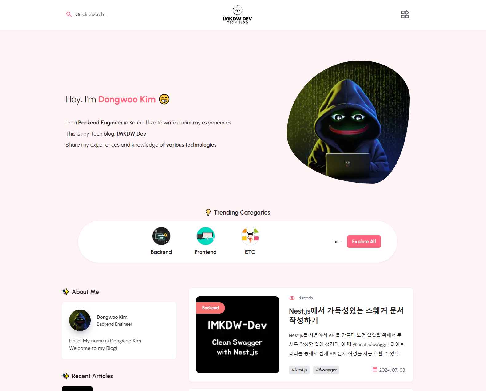
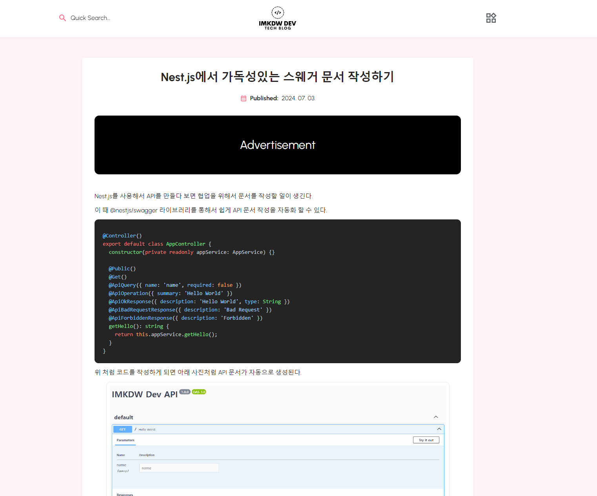

# Introduction

  

  <b>이미지를 누르면 블로그로 이동합니다</b>

 

  

    Node.js를 활용하여 직접 제작한 기술블로그 입니다.
     
    블로그는 데스크탑 크롬 웹 브라우저에 최적화 되어있습니다.
     
     
    클라이언트 깃허브 : <a href="https://github.com/IMKDW-Dev/imkdw-dev-client" target="_blank">imkdw/imkdw-dev-client</a>
     
     
    
    
  

 
 

# Links

1. 블로그 소개 : [블로그 소개글로 이동하기](https://imkdw.dev/articles/introduce-of-my-tech-blog-imkdw-dev-e0ex0rqh)
2. CI/CD 구성 : [CI/CD 구성 소개글로 이동하기](https://imkdw.dev/articles/introduce-of-imkdw-dev-cicd-pipeline-fo9igia5)
3. 인프라 구성 : [인프라 구성 소개글로 이동하기](https://imkdw.dev/articles/introduce-of-imkdw-dev-aws-infra-avsgg00u)
    
    

# Tech Stacks

- Nest.js

  - Prisma
  - Swagger
  - JWT
  - MYSQL 8.0

- Next.js

  - Tailwindcss
  - Zustand

- AWS

  - S3
  - CloudWatch
  - EC2
  - RDS

 

# Screenshots

  
메인

  

    
  

  
게시글 상세

  

    
  

 

# Env

  
펼치기

  <pre>
AWS_REGION=
AWS_IAM_ACCESS_KEY=
AWS_IAM_SECRET_ACCESS_KEY=

NODE_ENV=local

DATABASE_URL=

KAKAO_CLIENT_ID=

OAUTH_GITHUB_CLIENT_ID=
OAUTH_GITHUB_CLIENT_SECRET=

JWT_SECRET=
JWT_ACCESS_TOKEN_EXPIRES_IN=
JWT_REFRESH_TOKEN_EXPIRES_IN=

S3_BUCKET_NAME=
S3_BUCKET_URL=
S3_PRESIGNED_URL_EXPIRES_IN=
S3_PRESIGNED_BUCKET_NAME=
S3_PRESIGNED_BUCKET_URL=

CLOUDWATCH_LOG_GROUP_NAME=

SLACK_BOT_TOKEN=
SLACK_CHANNEL_ERROR=

</pre>

